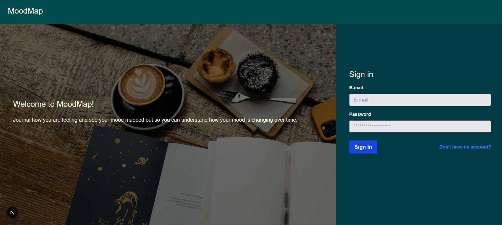
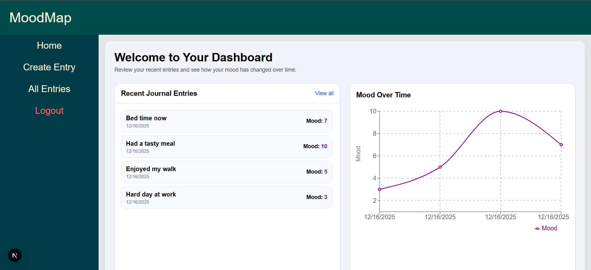
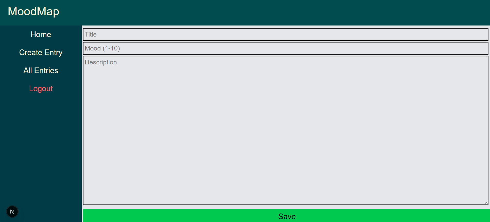

# MoodMap

MoodMap is a small full-stack web app where users can log how they’re feeling with short journal entries and see their mood trends over time.

It’s built as a learning project to practice **Next.js**, **FastAPI**, and **SQLModel**, with a focus on clean API design, auth, and a simple but real UI.

---

## Features

- **Account system**
  - User registration & login
  - Passwords stored as secure bcrypt hashes
  - JWT-based authentication and authorization

- **Journal entries**
  - Create mood entries with:
    - `mood` (1–10)
    - `title`
    - `body`
  - Entries are always scoped to the authenticated user  
    → you can only see your own data.

- **Dashboard**
  - List of all your entries, ordered by most recent
  - Click through to view full details for a single entry

- **Mood over time**
  - Dashboard fetches all of your entries and transforms them into `{ date, mood }` points
  - Renders a **mood-over-time chart** that updates when new entries are created

---

## Tech Stack

**Frontend**

- Next.js (App Router)
- TypeScript
- Zod for schema validation
- Fetching via a Next.js “proxy API” that talks to the backend

**Backend**

- FastAPI
- SQLModel + SQLAlchemy
- JWT auth (PyJWT)
- Password hashing via `passlib` (bcrypt)
- Relational database via `DATABASE_URL` (tested locally with a SQL database)

---

## Architecture Overview

- **Backend (`app/`)**
  - `app/main.py` – FastAPI application entrypoint
  - `app/api/` – routers (`/login`, `/users`, `/entries`, etc.)
  - `app/models.py` – SQLModel ORM models and Pydantic response models
  - `app/crud.py` – data access helpers for users and entries
  - `app/core/` – configuration, security (JWT, hashing), and DB setup

- **Frontend (`src/`)**
  - Next.js pages/routes for:
    - Dashboard
    - Create entry
    - View entry
  - Forms wired with Zod schemas and type-safe client/server interaction
  - Dashboard aggregates entries into data points for the mood chart

---

## Running Locally

> This project is currently intended to run locally (not deployed).

### 1. Backend (FastAPI)

From the backend root:

1. Create and activate a virtualenv (optional but recommended)
2. Install dependencies (example):
   ```bash
   pip install -r requirements.txt
   fastapi dev app/main.py
   ```

3. Set your environment variables

4. By default, the backend runs on [http://localhost:8000](http://localhost:8000).

---

### 2. Frontend (Next.js)

From the `src/` folder:

1. Install dependencies:

   ```bash
   npm install
   ```

2. Start the development server:

   ```bash
   npm run dev
   ```

3. The frontend will run on [http://localhost:3000](http://localhost:3000).

---

## Screenshots

### Landing page


### Dashboard


### Create Entry



---

## License

MIT


